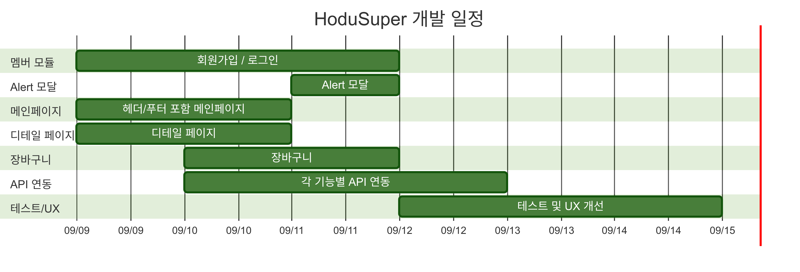
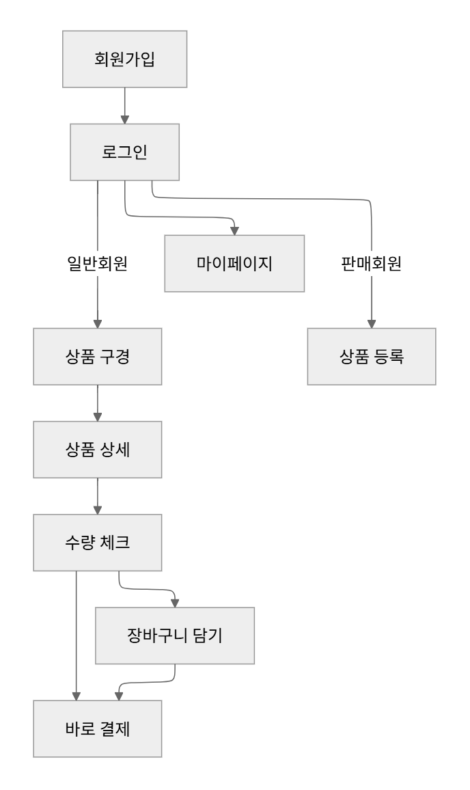
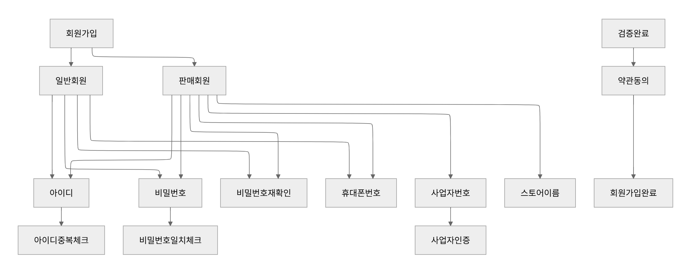

# HODU SUPER(오픈마켓 팀프로젝트 | 호두슈퍼)

## 목차

- [프로젝트 소개](#프로젝트-소개)
- [프로젝트 시연](#프로젝트-시연)
- [팀 소개](#팀-소개)
- [기술 스택](#기술-스택)
- [요구사항 명세](#요구사항-명세)
- [기능명세](#기능명세)
- [개발일정](#개발일정)
- [주요 기능](#주요-기능)
- [프로젝트 구조](#프로젝트-구조)
- [기능 흐름도](#기능-흐름도)
- [실행 방법](#실행-방법)
- [핵심 구현 사항](#핵심-구현-사항)
- [API 연동](#api-연동)
- [개발 과정](#개발-과정)
- [트러블 슈팅](#트러블-슈팅)
- [개발하며 느낀점](#개발하며-느낀점)

## 프로젝트 소개

**HODU SUPER**는 개발자를 위한 오픈마켓 플랫폼입니다. 개발자들이 필요로 하는 다양한 상품들을 구매할 수 있는 쇼핑몰로, 직관적인 UI/UX와 효율적인 기능들을 제공합니다.

- **프로젝트 기간**: 2025년 9월 8일 ~ 2025년 9월 15일(8일)
- **프로젝트 형태**: 팀 프로젝트
- **배포 주소**: https://yeaseula.github.io/HoduSuper/
- **테스트 계정**
```
<일반회원>
id: buyer11245
pass: asdfasdf12

<판매회원>
id: seller1191
pass: asdfasdf12
```

## 프로젝트 시연

### 메인 화면 및 상품 목록


### 상품 상세 및 장바구니 기능


### 회원가입 및 로그인


### 모바일 반응형 디자인


## 팀 소개

**러닝메이트** 팀으로 구성되어 있으며, 총 3명의 팀원이 협력하여 프로젝트를 완성했습니다.
< 러닝메이트 설명 추가하기>
| 역할 | 이름 | 담당 업무 |
| ---- | ------ | ------------------------------------------------------------------- |
| 팀장 | 김예슬 | 프로젝트 전반 총괄 및 프론트엔드 개발, 로그인&회원가입 로직 구현 등 |
| 팀원 | 김채현 | 프론트엔드 개발, 상품 상세페이지 및 재고 관리 로직 구현 등 |
| 팀원 | 이상민 | 프론트엔드 개발, 상품 리스트 및 장바구니 로직 구현 등 |

## 기술 스택

### Frontend

- **아키텍처**: MPA (Multi-Page Application) 방식으로 개발
- **HTML**: 시맨틱 마크업, 웹 접근성 고려
- **CSS**: Flexbox, Grid 레이아웃, 반응형 디자인
- **JavaScript (ES6+)**: 모듈화, 비동기 처리, DOM 조작
- **Swiper.js**: 메인 배너 슬라이더 구현

### API & 통신

- **Fetch API**: RESTful API 통신
- **LocalStorage**: 사용자 인증 정보 및 장바구니 데이터 관리
- **JSON**: 데이터 포맷

### SEO & 접근성

- **Meta 태그 최적화**: title, description, keywords, author 태그 설정
- **Open Graph**: SNS 공유용 og:title, og:description, og:image, og:url 설정
- **시맨틱 HTML**: HTML5 시맨틱 태그 및 ARIA 속성 활용
- **웹 접근성**: screen-reader 지원, 키보드 네비게이션, alt 텍스트

### 개발 도구

- **Git**: 버전 관리
- **GitHub**: 협업 및 배포
- **VS Code**: 개발 환경

## 요구사항 명세

### 기능적 요구사항

- 사용자 회원가입 및 로그인 기능
- 상품 목록 조회 및 상세 정보 확인
- 장바구니 관리 (추가, 수정)
- 상품 재고 관리 및 수량 제한
- 사용자 타입별 차별화된 헤더 메뉴 (구매자/판매자/비로그인)
- 반응형 웹 디자인

### 비기능적 요구사항

- 웹 접근성 준수 (WCAG 2.1 AA)
- 모바일 최적화 (반응형 디자인)
- 브라우저 호환성 (Chrome, Firefox, Safari, Edge)
- API 응답 시간 3초 이내
- 사용자 친화적 UI/UX

### 제약사항

- Vanilla JavaScript만 사용
- 외부 프레임워크/라이브러리 최소화
- 제공된 API만 사용

## 기능명세

### 1. 회원 관리 시스템

- **회원가입**: 구매회원/판매회원 구분 가입
- **로그인/로그아웃**: JWT 토큰 기반 인증
- **유효성 검사**: 실시간 입력값 검증

### 2. 상품 관리 시스템

- **상품 목록**: API 연동 상품 조회
- **상품 상세**: 이미지, 가격, 설명, 리뷰 정보
- **탭 기능**: 상품 정보, 리뷰, Q&A, 반품/교환정보 탭 전환

### 3. 장바구니 시스템

- **장바구니 추가**: 상품을 장바구니에 담기
- **수량 관리**: 상품 수량 증가/감소
- **선택 관리**: 개별/전체 선택 기능
- **가격 계산**: 실시간 총 금액 및 수량 계산

### 4. 사용자 인터페이스

- **반응형 디자인**: 모바일/태블릿/데스크톱 지원
- **로딩 상태**: 스피너 및 스켈레톤 UI 추가
- **알림 시스템**: 성공/실패 메시지 표시

## 개발일정



## 주요 기능

### 1. 메인 페이지

- **배너 슬라이더**: Swiper.js를 활용한 자동 슬라이딩 배너
- **상품 목록**: API를 통한 실시간 상품 데이터 표시
- **반응형 레이아웃**: 다양한 디바이스에서 최적화된 화면
- **품절 상품 표시**: 재고가 0인 상품에 품절 스타일링 적용

### 2. 상품 상세 페이지

- **상품 정보 표시**: 이미지, 가격, 배송 정보, 판매자 등
- **수량 선택**: 최소 1개, 최대 보유 수량까지 선택 가능
- **실시간 가격 계산**: 수량 변경 시 총 금액 및 수량 자동 업데이트
- **장바구니 추가**: 장바구니 담기 기능
- **탭 기능**: 상품 정보, 리뷰, Q&A, 반품/교환 정보 탭
- **품절 상품 표시**: 재고가 0인 상품에 품절 스타일링 적용

### 3. 장바구니 관리

- **상품 관리**: 체크박스를 통한 개별/전체 선택
- **재고 체크**: 장바구니 추가 시 기존 수량과 새 수량의 합이 재고를 초과하는지 확인
- **수량 조절**: 증가/감소 버튼으로 수량 변경
- **실시간 계산**: 상품금액, 할인, 최종 결제금액 자동 계산
- **재고 관리**: 재고 부족 시 알림 및 수량 제한

### 4. 회원 관리

- **회원가입**: 구매회원/판매회원 구분 가입
- **로그인**: JWT 토큰 기반 인증
- **유효성 검사**: 실시간 입력값 검증
- **중복 확인**: 아이디 및 사업자번호 중복 체크

### 5. 사용자 경험 (UX)

- **로딩 스피너 및 스켈레톤 UI**: 데이터 로딩 중 사용자 피드백
- **미니 알림**: 성공/실패 메시지 표시
- **에러 처리**: 404 페이지, 이미지 로드 실패 처리

## 프로젝트 구조

```
project/
├── assets/
│   ├── css/                 # 스타일시트
│   │   ├── reset.css        # CSS 초기화
│   │   ├── common.css       # 공통 스타일
│   │   ├── header.css       # 헤더 스타일
│   │   ├── main.css         # 메인 페이지 스타일
│   │   ├── product-detail.css # 상품 상세 스타일
│   │   ├── cart.css         # 장바구니 스타일
│   │   └── ...
│   ├── js/                  # JavaScript 파일
│   │   ├── api.js           # API 통신 모듈
│   │   ├── common.js        # 공통 기능
│   │   ├── product-list.js  # 상품 목록 관리
│   │   ├── product-detail.js # 상품 상세 관리
│   │   ├── cart.js          # 장바구니 관리
│   │   ├── cart-api.js      # 장바구니 API
│   │   └── ...
│   ├── images/              # 이미지 리소스
│   └── fonts/               # 폰트 파일
├── components/              # 재사용 컴포넌트
│   ├── header.html          # 헤더 컴포넌트
│   ├── footer.html          # 푸터 컴포넌트
│   ├── MiniAlert.js         # 알림 컴포넌트
│   └── member/              # 회원 관련 컴포넌트
├── pages/                   # 페이지 파일
│   ├── product-detail.html  # 상품 상세 페이지
│   ├── cart.html           # 장바구니 페이지
│   ├── login.html          # 로그인 페이지
│   ├── signup.html         # 회원가입 페이지
│   └── 404-page.html       # 404 에러 페이지
├── index.html              # 메인 페이지
└── README.md              # 프로젝트 문서
```

## 기능 흐름도

### 전체 시스템 기능 흐름도



### 회원가입 모듈 기능 흐름도



## 실행 방법

1. **저장소 클론**

   ```bash
   git clone https://github.com/yeaseula/HoduSuper.git
   cd HoduSuper
   ```

2. **로컬 서버 실행**

   - VS Code Live Server 확장 프로그램 사용
   - 또는 Python 간단 서버 실행:

   ```bash
   python -m http.server 8000
   ```

3. **브라우저에서 접속**
   ```
   http://localhost:8000
   ```

## 핵심 구현 사항

### 1. 모듈화된 JavaScript 구조

```javascript
// API 모듈 (api.js)
const API_CONFIG = {
  API_URL: "https://api.wenivops.co.kr/services/open-market",
  ENDPOINTS: {
    PRODUCTS: "/products/",
    PRODUCT_DETAIL: "/products/{id}",
  },
};

// 상품 목록 조회
const getProducts = async () => {
  try {
    const response = await fetch(
      `${API_CONFIG.API_URL}${API_CONFIG.ENDPOINTS.PRODUCTS}`
    );
    if (!response.ok) throw new Error("HTTP 에러 발생");
    return await response.json();
  } catch (error) {
    console.error("상품을 불러올 수 없습니다:", error);
    return { results: [] };
  }
};
```

### 2. 장바구니 상태 관리

```javascript
// 장바구니 상태 관리 클래스
class CartManager {
  constructor() {
    this.items = [];
    this.selectedItems = new Set();
    this.loadCartItems();
  }

  // 장바구니 아이템 추가
  async addItem(productId, quantity = 1) {
    const existingItem = this.items.find(
      (item) => item.product_id === productId
    );

    if (existingItem) {
      // 기존 아이템 수량 업데이트
      await this.updateQuantity(productId, existingItem.quantity + quantity);
    } else {
      // 새 아이템 추가
      await this.addNewItem(productId, quantity);
    }
  }
}
```

### 3. 실시간 가격 계산

```javascript
// 가격 계산 유틸리티
const calculateTotal = (items) => {
  const productTotal = items.reduce((sum, item) => {
    return sum + item.price * item.quantity;
  }, 0);

  const shippingFee = productTotal >= 30000 ? 0 : 3000;
  const discount = 0; // 할인 로직

  return {
    productTotal,
    shippingFee,
    discount,
    finalTotal: productTotal + shippingFee - discount,
  };
};
```

### 4. 사용자 인증 관리

```javascript
// 로그인 처리
async function loginAccess(fields) {
  try {
    const res = await fetch(
      "https://api.wenivops.co.kr/services/open-market/accounts/login/",
      {
        method: "POST",
        headers: { "Content-Type": "application/json" },
        body: JSON.stringify({ username, password }),
      }
    );

    if (res.ok) {
      const data = await res.json();
      // 토큰 저장
      localStorage.setItem("access", data.access);
      localStorage.setItem("refresh", data.refresh);
      localStorage.setItem("user", JSON.stringify(data.user));
    }
  } catch (error) {
    console.error("로그인 실패:", error);
  }
}
```

## API 연동

### 사용 API

- **Base URL**: `https://api.wenivops.co.kr/services/open-market`
- **상품 목록**: `GET /products/`
- **상품 상세**: `GET /products/{id}`
- **회원가입**: `POST /accounts/buyer/signup/`, `POST /accounts/seller/signup/`
- **로그인**: `POST /accounts/login/`
- **장바구니**: `GET/POST /cart/`

### 에러 처리

```javascript
// API 에러 처리
if (!response.ok) {
  if (response.status === 404) {
    console.log("404 - 상품을 찾을 수 없어 404 페이지로 이동합니다.");
    redirectTo404();
    return null;
  } else if (response.status === 500) {
    console.log("500 - 서버 내부 오류");
    return null;
  } else {
    throw new Error(`HTTP 에러 발생: ${response.status}`);
  }
}
```

## 개발 과정

### 1단계: 프로젝트 기획 및 설계

- 요구사항 분석 및 기능 정의
- 프로젝트 구조 설계
- 업무 분담

### 2단계: 기본 구조 구현

- HTML 마크업 구조 작성
- CSS 스타일링 및 반응형 디자인
- 공통 컴포넌트 개발 (헤더, 푸터, 알림)

### 3단계: 핵심 기능 개발

- API 연동 모듈 구현
- 상품 목록 및 상세 페이지 개발
- 장바구니 기능 구현
- 회원가입/로그인 기능
- 회원가입 유효성 검사 및 에러 처리
- 사용자 인증 상태 관리

### 4단계: 최적화 및 테스트

- 버그 수정 및 기능 검증
- 브라우저 호환성 테스트
- 사용자 경험 개선

## 트러블 슈팅

### **1.이미지 경로 문제**

- 문제: `index.html`과 서브페이지의 경로 차이로 인해 컴포넌트 내부 이미지가 노출되지 않음
- 해결: 경로를 변수화하여 상황에 따라 다르게 적용

```jsx
const pathPrefix = location.pathname.includes('/pages/') ? '../' : '';
const pathPrefixfile = location.pathname.includes('/pages/') ? '' : 'pages/';
```

### **2.로그인 상태별 헤더 버튼 처리**

- 문제: 로그인 여부에 따라 헤더 버튼 구성이 달라야 함
- 해결: 헤더 정보를 객체로 관리하고, 유저 상태에 따라 DOM을 동적으로 조립

```jsx
const menulist = {
  cart: { element: 'button', className: 'user-cart', descript: '장바구니' },
  cartLogin: { element: 'a', className: 'user-cart', descript: '장바구니', link: `${pathPrefixfile}cart.html` },
  login: { element: 'a', className: 'user-login', descript: '로그인', link: `${pathPrefixfile}login.html` },
  mypage: { element: 'button', className: 'user-mypage', descript: '마이페이지' },
  sellerCenter: { element: 'a', className: 'seller-center', descript: '판매자 센터' },
};
```

### **3.회원가입 유형별 필드 노출 및 검증**

- 문제: 일반회원/판매회원에 따라 다른 필드가 필요하고, 값 검증 시 동적으로 경고 문구가 노출되어야 함
- 해결: 회원가입 폼을 클래스로 설계해 유지보수성을 높이고, 상태관리 객체로 실시간 검사

```jsx
const joinState = {
  userType: targetInput.value || 'buyer',
  isIdChecked: false,
  isPassMatch: false,
  isAllField: false,
  isAgree: false,
  isSellerNumber: false,
};
```

### **4.상품 상세페이지 탭 디자인 부족**

- 문제: 상세페이지 탭 UI가 미완성
- 해결: JSON 형태로 데이터를 관리하고 화면에 동적으로 반영

### 5. 모바일 디자인 미흡

- 문제: 모바일 환경 대응 부족
- 해결: 다양한 쇼핑몰 앱 디자인을 참고하여 반영

### 6. FIFO

- 문제: 첫 방문 시 메인 페이지의 FIFO 현상이 두드러짐
- 해결: 첫 방문 여부를 session storage에 값을 저장해두고 판단→첫 방문 시 loading 이미지를 약 1초가량 노출, 가장 무거운 메인 페이지에 한해 link preload 태그 활용

```jsx
    <link rel="preload" href="./assets/css/reset.css" as="style" onload="this.rel='stylesheet'">
    <link rel="preload" href="./assets/css/common.css" as="style" onload="this.rel='stylesheet'">
    <link rel="preload" href="./assets/css/fonts.css" as="style" onload="this.rel='stylesheet'">
    <link rel="preload" href="./assets/css/header.css" as="style" onload="this.rel='stylesheet'">
    <link rel="preload" href="./assets/css/main.css" as="style" onload="this.rel='stylesheet'">
    <link rel="preload" href="./assets/css/footer.css" as="style" onload="this.rel='stylesheet'">
    <noscript>
      <link rel="stylesheet" href="./assets/css/reset.css">
      <link rel="stylesheet" href="./assets/css/common.css">
      <link rel="stylesheet" href="./assets/css/fonts.css">
      <link rel="stylesheet" href="./assets/css/header.css">
      <link rel="stylesheet" href="./assets/css/main.css">
      <link rel="stylesheet" href="./assets/css/footer.css">
    </noscript>
```

### 7. **복잡한 재고 관리 로직 구현**

- **문제**: 상품 상세에서 장바구니 추가 시 기존 장바구니 수량과 새로 추가할 수량의 합이 재고를 초과하는 경우 처리
- **해결**: checkStock() 함수를 구현하여 현재 장바구니 수량 + 추가 수량이 재고를 초과하는지 체크하고, 초과 시 MiniAlert를 통한 알림창 표시 및 최대 재고 수량으로 자동 조정

### 8. **스크롤 기반 탭 활성화 구현**

- **문제**: tab-contents.js에 상품별로 다른 객체 데이터가 저장되어 있어 각 상품마다 탭 콘텐츠의 높이와 구조가 달라 스크롤 위치 감지가 어려움
- **해결**: getBoundingClientRect() 메서드를 활용하여 각 탭 섹션의 실시간 화면상 위치를 동적으로 감지하고, 스크롤 위치에 따라 적절한 탭에 active 클래스를 적용. 탭 클릭 시에는 scrollIntoView() 메서드로 해당 섹션으로 부드럽게 스크롤 이동하도록 구현

### 9. DOM 요소 캐싱

```jsx
// ===== DOM 요소 캐싱 섹션 =====
// 자주 사용되는 DOM 요소들을 미리 선택하여 성능 최적화
// 페이지 로드 시 한 번만 선택하고 재사용
const dom = {
  cartContainer: document.querySelector(".cart-products-content"), // 장바구니 상품 목록 컨테이너
  orderSection: document.querySelector(".cart-order-content"), // 주문 요약 섹션
  totalOrderBtn: document.querySelector(".total-order-btn"), // 전체 주문하기 버튼
  totalPriceElem: document.querySelector(".total-price .order-price"), // 총 상품금액 표시 요소
  finalPriceElem: document.querySelector(".final-price .order-price"), // 최종 결제금액 표시 요소
  allCheckBox: document.querySelector(".cart-list .check-box"), // 전체 선택 체크박스
  addToCartButtons: document.querySelectorAll(".add-to-cart-btn"), // 장바구니 담기 버튼들 (상품 페이지용)
};

```

- **문제**: 웹페이지에 자주 접근하는 요소들일 경우 성능부담, 똑같은 DOM 코드가 여러번 반복되어 코드가 길어지고 가독성 저하
- **해결**: 자주 사용되는 HTML요소를 자바스크립트 변수에 미리 할당하여 성능 최적화(페이지 로드 시 한번만 실행, 변수에 저장)

### 10. 이벤트 위임

```jsx
// ===== 이벤트 리스너 설정 섹션 =====
// 동적으로 생성된 DOM 요소들에 대한 이벤트 위임 및 바인딩
// 이벤트 위임을 활용하여 동적 요소들도 자동으로 이벤트 처리

function setupCartItemClickEvents() {
  dom.cartContainer.addEventListener("click", (e) => {
    const productEl = e.target.closest(".cart-product"); // 클릭된 요소의 상위 상품 요소 찾기
    if (!productEl) return; // 상품 영역 외부 클릭 시 무시

    const itemId = productEl.dataset.id; // data-id로 상품 식별

    // 클릭된 요소를 분석하여 적절한 핸들러 호출
    if (e.target.closest(".check-box")) {
      handleItemCheckboxClick(itemId, e.target.closest(".check-box"));
    } else if (e.target.closest(".quantity-btn.decrease")) {
      handleQuantityDecrease(itemId);
    } else if (e.target.closest(".quantity-btn.increase")) {
      handleQuantityIncrease(itemId);
    } else if (e.target.closest(".close-btn")) {
      handleItemRemove(itemId);
    } else if (e.target.closest(".individual-order-btn")) {
      handleIndividualOrder(itemId);
    }
  });
}
```

- **문제**:  새로운 장바구니 상품이 동적으로 추가되거나 삭제 될 때마다 새로 추가된 요소에 이벤트를 수동으로 다시 바인딩, 개별적으로 이벤트 등록으로 인한 전체 코드 길이가 길어져 가독성 저하
- **해결**: 부모요소의 클릭 이벤트를 등록하여 이벤트 버블링 활용, 부모요소까지 전달

## 개발하며 느낀점

### 기술적 성장

- **모듈화의 중요성**: 기능별로 모듈을 분리하여 코드의 재사용성과 유지보수성을 크게 향상시켰습니다.(MiniAlert, Header, Footer)
- **비동기 처리**: Promise와 async/await를 활용한 비동기 처리로 사용자 경험을 개선했습니다.
- **에러 처리**: 예외 상황에 대한 적절한 처리가 사용자 경험에 미치는 영향을 깊이 이해했습니다.

### 협업 경험

- **Git 활용**: 브랜치 전략과 충돌 해결을 통해 협업의 중요성을 배웠습니다.
- **코드 리뷰**: 팀원 간의 코드 리뷰를 통해 더 나은 코드 품질을 추구했습니다.
- **커뮤니케이션**: 명확한 의사소통이 프로젝트 성공의 핵심임을 깨달았습니다.

### 향후 개선 방향

- **검색 기능**: 현재 기본적인 검색에서 고도화된 필터링 기능 추가
- **장바구니 기능 추가**: PUT, DELETE 등 기능 추가
- **성능 최적화**: 이미지 지연 로딩, 코드 스플리팅 등 성능 개선
- **CSS 개선**: 공통 스타일 클래스화

이 프로젝트를 통해 프론트엔드 개발의 전반적인 프로세스를 경험하고, 실제 사용자가 사용할 수 있는 웹 애플리케이션을 완성하는 소중한 경험을 얻었습니다.

- 본 프로젝트는 [모두의연구소/위니브] 프론트엔드 스쿨 JavaScript 프로젝트 목적으로 제작되었습니다.
